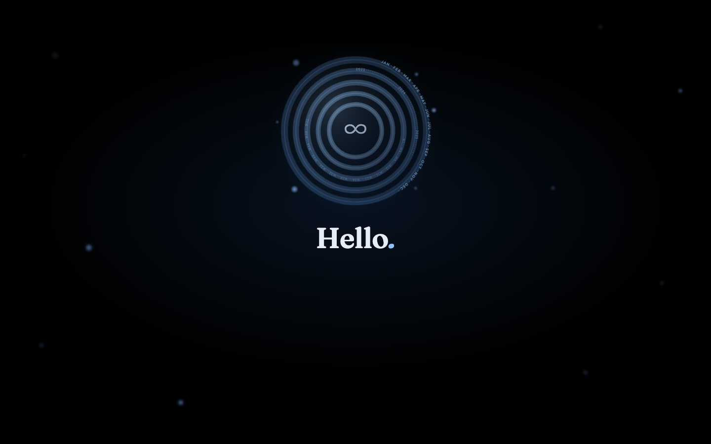
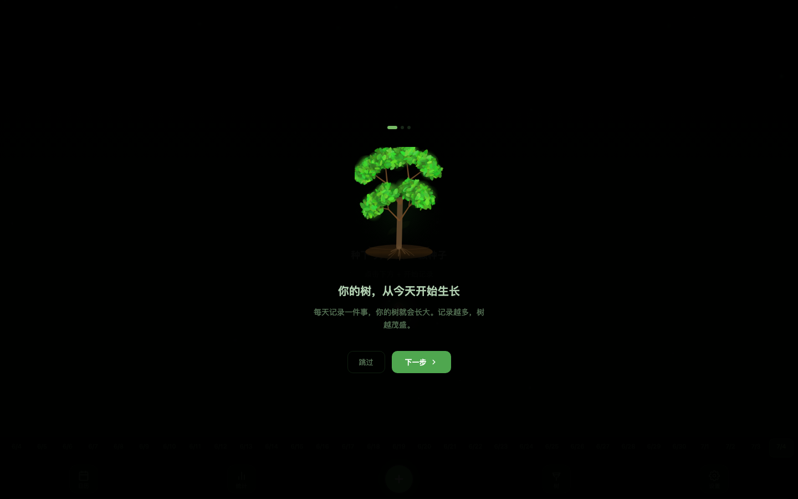
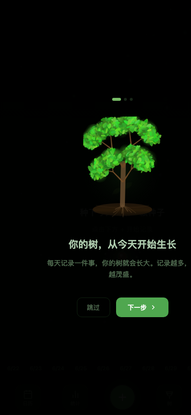
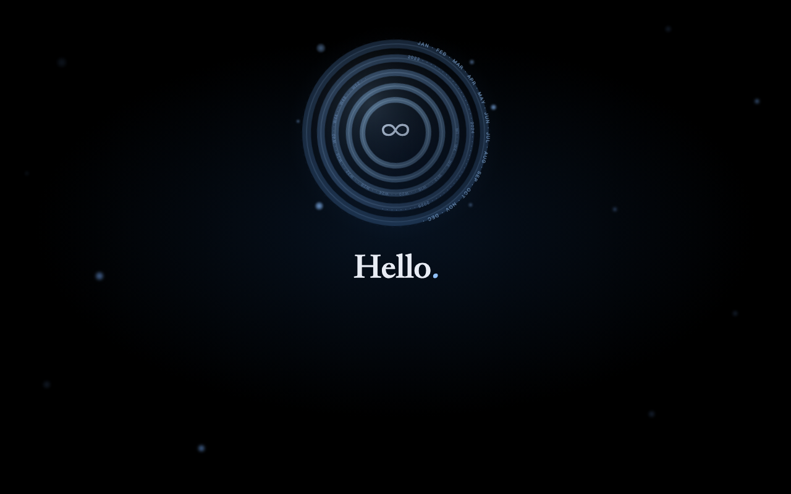

<div align="center">

[🇨🇳 简体中文](#-简体中文) | [🇺🇸 English](#-english-version)

</div>

---

# 🇨🇳 简体中文

# 🌲 每日一树 · Daily Tree

> **把「日常记录」种成一片随岁月生长的记忆森林。**
> 这不是一款传统的流水账日记本。我们设定了一个极具美感的克制限制：**每天只记录一件事、一个闪光时刻**。你连续打卡的每一天，都会让一颗树苗从种子生根发芽，茁壮成长为参天大树；每一个自然年，都会在你的精神世界里化作一棵独一无二的 3D 记忆之树。

**🕹️ 在线体验：[进入记忆森林 →](https://zhuxinyao99-jpg.github.io/daily-tree/app/)** &nbsp;|&nbsp; **[3D 着陆页 (Landing) →](https://zhuxinyao99-jpg.github.io/daily-tree/)**

**🖥️📱 多端无缝适配，将精神森林随身携带：**

| 设备场景 | 交互体验 | 核心优势 |
|---|---|---|
| 💻 **桌面端 / 笔记本** | WebGL / Three.js 高帧率 3D 渲染 | 支持鼠标拖拽自由旋转大树角度，俯瞰整片森林时间线 |
| 📱 **移动端 / 手机** | 触屏滑动手势优化 | 左右滑动浏览今日记忆卡片，随时随地写下今日心得 |
| 💬 **微信 / 社交内嵌** | 聊天框直接打开即写 | 极速加载，无需下载 App，轻量化打卡最爱 |
| 📲 **iPad / 平板** | 自适应横竖屏大视野 | 沉浸式观察树干纹理、茂密枝叶与光影变迁 |

*说明：你的私密心事仅属于你。所有日记内容 100% 存储在你设备本地（LocalStorage），不上传任何云端服务器。*

---

## 📷 见证你的时光森林

*（以下为展示预留区，推荐放入你的精彩项目截图）*

| | |
|:---:|:---:|
|  **3D 记忆之树**：根据连续打卡天数（Streak），树木形态从幼苗进化至参天大树 |  **实时气象联动**：接入 Open-Meteo API，窗外下雨刮风，你的森林也同时沐浴风雨 |
|  **时光卡片**：左右滑动重温过去每天的那唯一闪光时刻 |  **克制美学**：每日一记，拒绝冗长焦虑，只留纯粹感动 |

---

## 为什么做这个项目？

- **传统日记太容易放弃**：面对一片空白的纸张，很多人不知道写什么，最后变成三天打鱼两天晒网；
- **克制才能产生精华**：限制“每天只记一件事”，能倒逼你在睡前过滤掉繁杂琐事，提取出今天最值得纪念的瞬间；
- **视觉化的时间积累**：日记本写完了只能合上落灰，而在 Daily Tree 中，你的坚持能直观地转化为一片枝繁叶茂、随着现实天气呼吸的森林。

---

## 🌟 核心特性

| 特性 | 说明 |
|---|---|
| 🌱 **打卡驱动生长 (Streak Growth)** | 连续记录天数决定树木形态。从 0 天的破土种子，到 30 天的青涩小树，再到 365 天的巨型神树 |
| 🎮 **高精度 WebGL 3D 渲染** | 基于 Three.js 打造，逼真的树干纹理、分枝算法与动感叶片，支持 360 度自由旋转观赏 |
| 🍂 **真实四季变换** | 树木色彩随自然季节流转：春季嫩绿吐芽 ➔ 夏季深邃浓荫 ➔ 秋季金黄灿烂 ➔ 冬季银装素裹 |
| ☀️ **实时气象共鸣 (Weather API)** | 自动获取本地真实天气。今天下雨，森林立刻淅淅沥沥；今天晴朗，森林洒落阳光 |
| 🔒 **纯粹私密零干扰** | 没有社交广场，没有点赞评论，不收集任何隐私。纯静态页面 + 本地存储，心灵的绝对净土 |
| ⚡ **自动化极速部署** | 搭载 GitHub Actions 持续集成，每次修改提交代码，自动 1 分钟内构建发布至 GitHub Pages |

---

## 🚀 快速开始 / 本地开发

无需任何后端数据库或复杂安装：

```bash
# 1. 克隆仓库
git clone https://github.com/nuts-and-bytes/daily-tree.git
cd daily-tree

# 2. 启动本地静态服务器（推荐使用 Python 或 serve）
python3 -m http.server 8000
# 或：npx serve .

# 3. 打开浏览器访问：
# 森林主程序：http://localhost:8000/app/index.html
# 3D 视觉着陆页：http://localhost:8000/landing.html
```

---

## ⌨️ 快捷键

| 快捷键 | 功能 |
|---|---|
| `Ctrl + N` / `Cmd + N` | 立即撰写今日记忆 |
| `Ctrl + Enter` / `Cmd + Enter` | 保存并提交当前日记 |
| `Esc` | 关闭弹窗 / 退出浏览 |

---

## 📜 许可与共建

代码采用 **MIT 开源许可证**。欢迎提 Issue 参与共建你的精神森林！

⭐ **如果这片安静的森林抚慰了你的心灵，请点个 Star 让更多人拥有一片属于自己的林地！**

---
---

# 🇺🇸 English Version

# 🌲 Daily Tree

> **Watch your daily life grow into a living 3D forest.**
> This is not just another journaling app. We designed an intentional constraint: **record only one thought, one meaningful moment per day**. With every consecutive daily entry, you nurture a seedling into a towering ancient tree. Over time, your memories manifest as a magnificent, living 3D forest.

**🕹️ Live Demo: [Enter Your Forest →](https://zhuxinyao99-jpg.github.io/daily-tree/app/)** &nbsp;|&nbsp; **[3D Landing Page →](https://zhuxinyao99-jpg.github.io/daily-tree/)**

**🖥️📱 Seamless Multi-Device Experience:**

| Device | How to Play | Experience |
|---|---|---|
| 💻 **Desktop / Laptop** | High-framerate WebGL / Three.js | Full 360° rotation, zoom, and panoramic view of your entire timeline forest |
| 📱 **Mobile Phones** | Touch & Swipe optimized | Swipe through daily memory cards, write down reflections effortlessly on the go |
| 💬 **WeChat / In-App** | Direct instant loading | No app downloads required; lightweight and fast for daily check-ins |
| 📲 **Tablets / iPad** | Adaptive landscape/portrait | Immersive widescreen observation of tree canopy, lighting, and weather effects |

*Note: Your thoughts are entirely yours. All journal entries are stored 100% locally in your browser (LocalStorage). No data ever leaves your device.*

---

## 📷 See Your Forest Grow

*（Recommended image placeholders for your repository screenshots）*

| | |
|:---:|:---:|
|  **3D Memory Tree**: Your tree evolves dynamically from a tiny seed to an ancient giant based on your streak |  **Real-Time Weather**: Integrated with Open-Meteo API. If it rains outside your window, it rains in your forest |
|  **Memory Carousel**: Swipe through your past entries to relive the single best moment of each day |  **Intentional Constraint**: One entry per day keeps journaling stress-free and deeply meaningful |

---

## 🌟 Core Features

| Feature | Description |
|---|---|
| 🌱 **Streak-Based Growth** | Consecutive entries drive visual evolution. Watch your tree progress from 0 days (seed) to 365+ days (ancient tree) |
| 🎮 **High-Fidelity WebGL 3D** | Powered by Three.js with procedural branch generation, organic foliage variation, and dynamic lighting |
| 🍂 **Seasonal Colors** | Tree canopy transitions naturally across four seasons: Spring green ➔ Summer forest ➔ Autumn gold ➔ Winter silver |
| ☀️ **Real-Time Weather API** | Automatically reflects your local weather conditions (sunshine, rain, snow, thunderstorms) inside the 3D scene |
| 🔒 **100% Private & Serverless** | Zero backend, zero analytics, zero social pressure. A private digital sanctuary living entirely in your browser |

---

## 🚀 Quick Start

```bash
# 1. Clone repository
git clone https://github.com/nuts-and-bytes/daily-tree.git
cd daily-tree

# 2. Run locally
python3 -m http.server 8000
# Open http://localhost:8000/app/ in your browser
```

---

## 📜 License

MIT License. Contributions, issues, and feature requests are welcome!

⭐ **If this peaceful forest brings you tranquility, please give it a Star to help it grow!**
